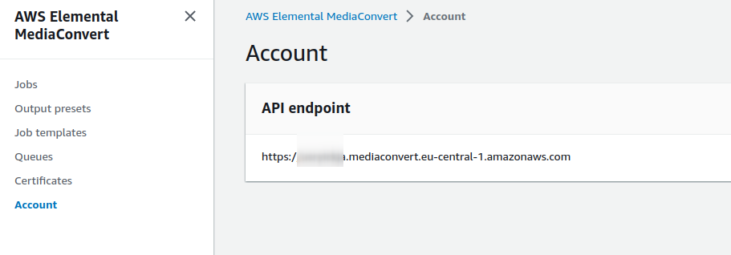
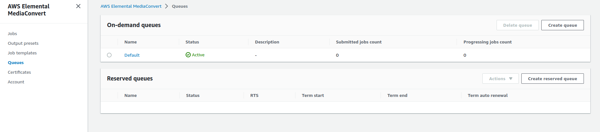
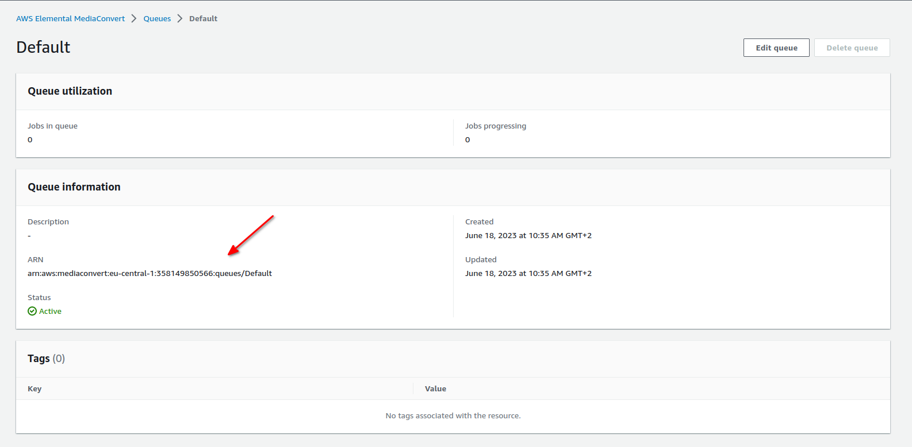

## Elastic Beanstalk

zip ../symfony-default.zip -r * .[^.]* -x "vendor/*" -x "var/*"

[Creating and deploying PHP applications on Elastic Beanstalk](https://docs.aws.amazon.com/elasticbeanstalk/latest/dg/php-symfony-tutorial.html)

## MediaConvert

To create a job in AWS MediaConvert you have to manually create IAM role, which has access to S3 bucket - [Docs](https://docs.aws.amazon.com/mediaconvert/latest/ug/creating-the-iam-role-in-iam.html).

You also need endpoint for AWS MediaConvert. You can get this endpoint by calling `/media-convert/endpoints` or from AWS Console.
Open AWS Console, go to service "AWS Elemental MediaConvert", and from left menu choose "Account".
You should see a dedicated API url:



Similar you need receive MediaConvert Queue ARN from AWS Console.
Open AWS Console, go to service "AWS Elemental MediaConvert", and from left menu choose "Queues".
You should see a list of queues.



Select a default queue (should always exist) and from "Queue information" copy ARN.



With this data you can send a POST request to `/media-convert/create-job` with body
```json
{
  "endpoint": "your-media-convert-endpoint",
  "source_file": "s3://your-bucket/your-file-to-convert",
  "destination_file": "s3://your-bucket/your-converted-file",
  "iam_role_arn": "you-arn-role-for-media-convert",
  "media_converter_queue_arn": "your-arn-of-media-convert-queue"
}

```
